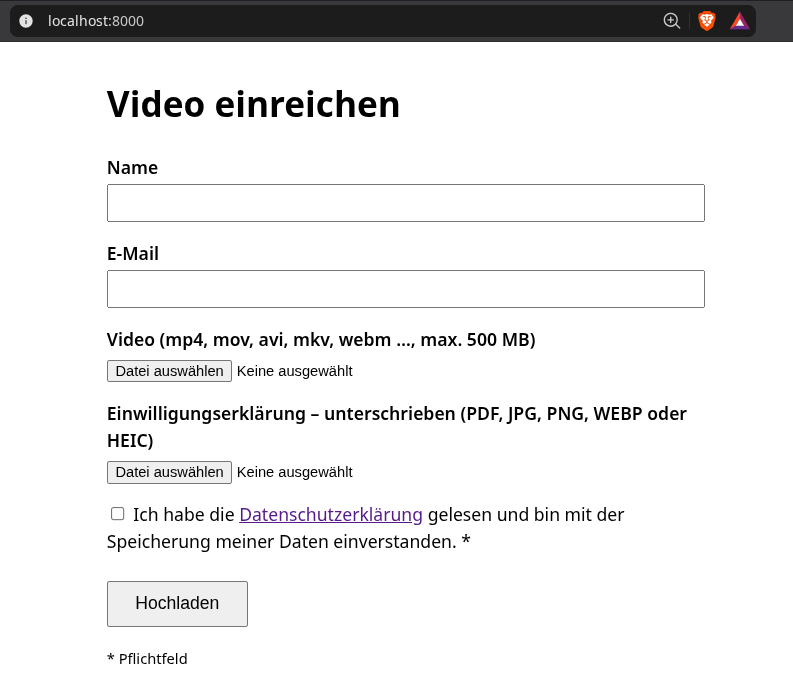

# Video Upload with Consent (dockerized)

Upload-Formular: Video + unterschriebene Einwilligungserklärung (PDF/Foto) + Name + E-Mail.

- Start: `docker compose up -d --build` → http://localhost:8000
- Uploads landen in `./data/` (Videos + Einwilligungen) + `data/meta.jsonl` (Metadaten).
- Größe-Limit: `MAX_MB` in `docker-compose.yml` (default 500).
- **Vor dem Go-Live:** echte Datenschutzerklärung in `app.py` → `PRIVACY_HTML` einsetzen.
- HTTPS vor den Container stellen (Reverse Proxy), Port 8000 nicht direkt ins Internet.
- Test: `pip install flask flask-limiter clamd && python3 test_app.py`
- Lizenz: [Apache-2.0](LICENSE)

## Sicherheit

- **Virenscan (ClamAV):** Jede Datei wird vor der Annahme per `clamd` gescannt.
  Infiziert → Dateien gelöscht, 400. Scanner nicht erreichbar → Ablehnung (fail closed).
- **Rate-Limit:** 20 Uploads/Stunde, 200/Tag pro IP (`RATE_LIMIT` in `docker-compose.yml`).
- **Security-Header:** CSP, `nosniff`, `X-Frame-Options`, `Referrer-Policy`.
- **Container-Härtung:** read-only Root-FS, `cap_drop: ALL`, `no-new-privileges`.
- **Eindeutige Dateinamen** (UUID-Suffix) verhindern Überschreiben von Uploads.

`./data` muss für UID 1000 beschreibbar sein (`chown 1000:1000 data`), da der
Container-Prozess als eigener unprivilegierter User läuft.
